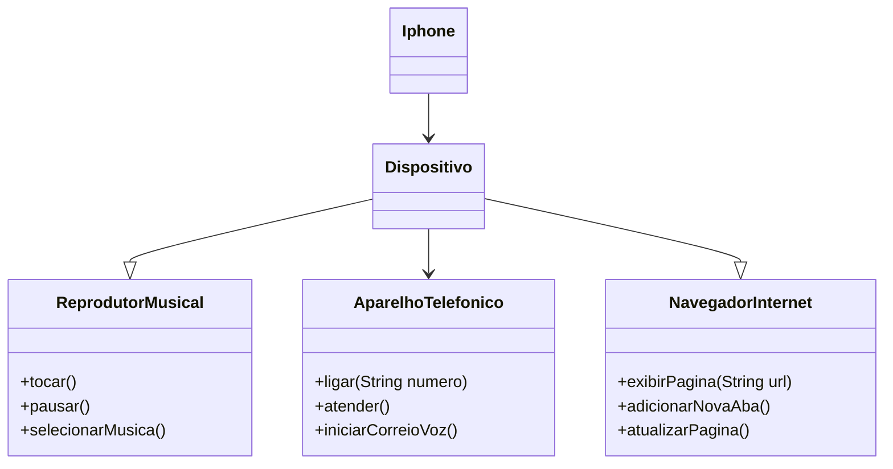

## Desafio Claro - POO

Desafio de criação de diagrama UML + implementação desse diagrama( opcional ) realizado durante bootcamp.

### Diagrama UML (Mermaid)

### Creditos

Todas as informações contidas nesse `README` são do arquivo do proprio desafio disponivel no seguinte link [trilha-java-basico-desafio](https://github.com/digitalinnovationone/trilha-java-basico/blob/main/desafios/poo/README.md)
